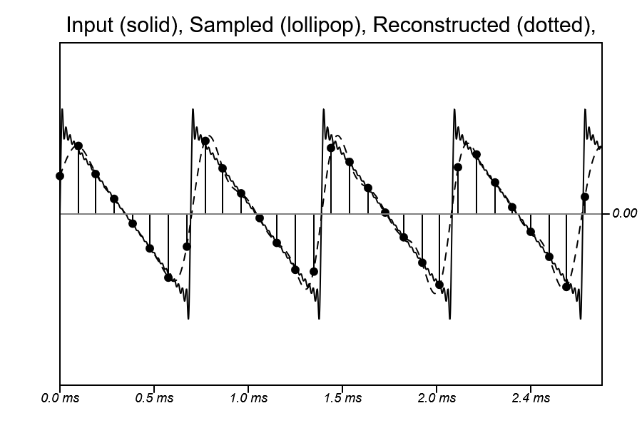

# Digital Audio Workbench 2

By Arden Butterfield, Josh Rohs, Travis J. West & Marcelo M. Wanderley
with contributions by Laurent Tarabout

Copyright CIRMMT/McGill University, 2026, based on IDMIL's 
[Digital Audio Workbench](https://idmil.github.io/DigitalAudioWorkbench/).

Sampling, quantization, antialiasing, and delta-sigma modulation are interrelated topics with applications in digital
audio. In these workbenches, we aim to provide a playground that helps students gain intuitive understanding of these
topics, by letting students both see and hear the consequences of their choices of sampling rate, delta-sigma step, or 
filter order on a variety of test signals.

Digital Audio Workbench 2 is hosted at https://idmil.github.io/DigitalAudioWorkbench-Tutorial/.

## Overview of Modules

Unlike the original Digital Audio Workbench, this version separates the process into modules, each with its own
parameters and visualizations. The signal can be thought of as cascading through the modules in order, and can be
listened to at multiple steps along the way. Modules can be collapsed using the button in the upper right.

### Input Module

Aliasing artifacts created by sampling and quantization are highly dependent on the frequency and timbre of the input
signal, so a variety of signal parameters are provided to the user. Input signals include alias-free saw waves, square
waves, and triangle waves, a variety of other tones generated through additive synthesis, as well as sample playback
of real recordings.

### Filter Module

Two filters are currently available: a truncated sinc Finite Impulse Response (FIR) filter, and a Butterworth Infinite
Impulse Response (IIR) filter. Both filters are locked to the Nyquist limit, or half of the sampling rate, as the cutoff
frequency. The filter order can be changed by the user, from 0 up to 200. At higher orders, the Butterworth filter
becomes unstable, likely due to an accumulation of floating point errors.

### Sample Rate Module

In this module, the filtered audio from the previous step is sampled at a regular sample rate, as set in Hertz by the 
slider.

### Dither/Quantization Module

When audio is converted to digital, it is often stored as a fixed-point binary number, which at low precision can add
additional audible artifacts to the sound. By default, these artifacts sound as inharmonic spikes in the frequency
domain, but these spikes can be smoothed out into flatter noise with the addition of noise before quantization, called
dithering.

### Reconstructed Module

Finally, the digital audio must be played back, which requires a second filter to smooth the waveform between the
samples to prevent imaging.

## Further Developments

Several potential further developments of the Digital Audio Workbench 2 are outlined below.

- Implementation of more filter types, or implementation of a Butterworth filter without the instability at high frequencies.
- Option to decouple the filter frequency from the sampling rate.
- Fix visual aliasing bug at high delta-sigma sampling rates and steps.
- Modernize graphic design.
- Improved code organization. An attempt was made late in the process to refactor the code into module classes, but
was not completed and the changes were left on the `section-refactor` branch. Depending on future directions with the
project, this refactor may or may not make sense.
- Add tooltips to the modules with connections to sampling theory and practice, or suggestions of things for students
to try.
- Screen reader accessibility testing and improvement.
- Find ways to support sample rates that are not divisors of the Web Audio sample rate (96000 Hz).